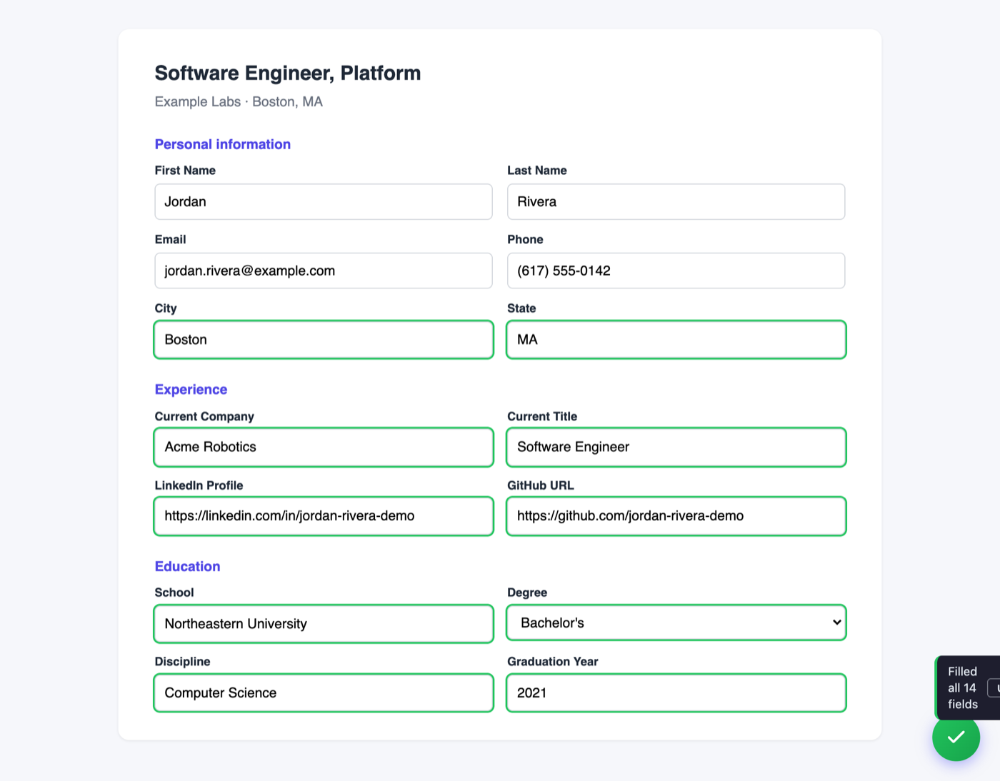
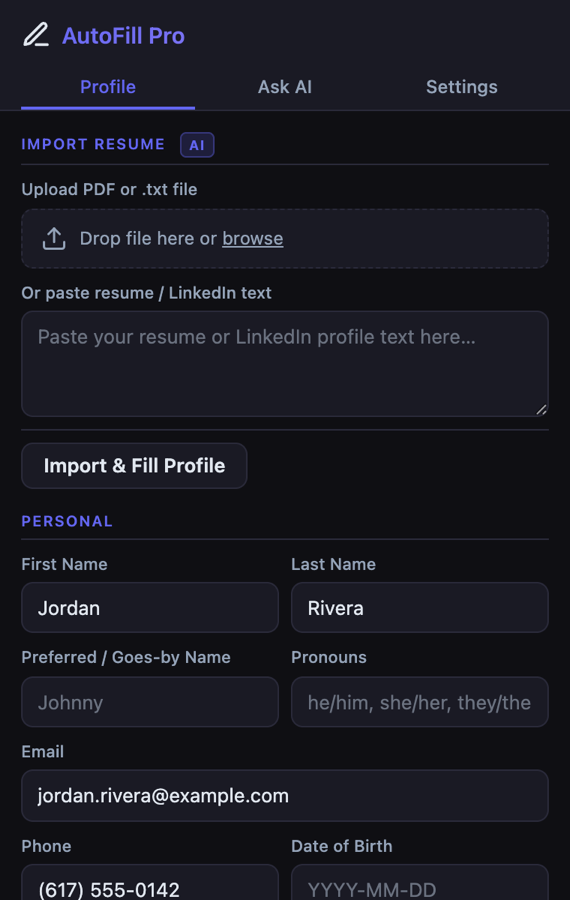

# AutoFill Pro

A browser extension that fills out job applications and web forms for you.

[](https://github.com/sandeepvijayarao09/autofill-pro/actions/workflows/ci.yml)
[](LICENSE)



<sub>The unpacked extension in Chrome for Testing, filling
`test/fixtures/plain_application.html` from a fictional profile.</sub>

You enter your details once (or import them from your resume), and from then on
a single click — or `Alt+Shift+F` — fills the whole form on any site. It
recognizes 44 common fields, and its patterns are tested against field labels
from 46 job sites and applicant-tracking systems (Greenhouse, Lever, Workday,
iCIMS, Taleo, Ashby and more). Without an AI key, everything you type stays on
your own device.

> **It's yours.** Install it, type in *your* data, and it fills forms with *your*
> data. Anyone you share it with does the same with theirs — no accounts, no
> sign-up, no server.

---

## Install (2 minutes)

1. Download or clone this folder to your computer.
2. Open `chrome://extensions` in Chrome.
3. Turn on **Developer mode** (top-right toggle).
4. Click **Load unpacked** and select this folder.
5. Pin the **AutoFill Pro** icon to your toolbar.

> Works in Chrome, Edge, Brave, and any other Chromium browser.

## Add your data



Click the AutoFill Pro icon to open the popup, then either:

- **Type it in** — fill the Profile tab (name, contact, work, education, links)
  and click **Save Profile**, or
- **Import your resume** — drop a PDF or paste your LinkedIn text at the top of
  the Profile tab and click **Import & Fill Profile**. Review what it pulled out,
  then **Save**. Import uses the AI parser, so it needs the API key described
  below. The PDF is read locally, and your email, phone and street address are
  removed from the text before it is sent; the rest of the resume text goes to
  NVIDIA NIM.

Your profile is stored locally in your browser. Nothing is sent anywhere unless
you add an AI key (below).

## Use it

On any application page:

- Click the floating purple button, or press **`Alt+Shift+F`**.
- **Long-press** the button (hold ~½ second) to *preview* what will be filled
  before committing.
- After a fill, an **Undo** button appears in case you want to revert.

## Optional: AI for custom questions

Some applications ask open-ended questions ("Why do you want to work here?")
that can't be matched by a fixed field. If you want help with those:

1. Get a free API key from [NVIDIA NIM](https://build.nvidia.com).
2. Open the popup → **Settings** → paste the key → enable **AI matching**.

With a key and AI on, these go to NVIDIA NIM: the labels of fields the patterns
could not match and custom questions, together with your profile minus the
sensitive fields; text that needs shortening to fit a character limit; and
resume text on import, with contact details removed first. Your date of birth,
race/ethnicity, gender, pronouns, disability/veteran status, phone, salary, visa
status and clearance are **never** sent from your profile. Without a key,
nothing leaves your device.

## Privacy in one line

No server, no tracking, no accounts. Your profile lives in your browser's local
storage; the only outside service is NVIDIA NIM, and only if you add a key.
Full details: [privacy_policy.html](./privacy_policy.html).

---

## For tinkerers

Everything runs in plain JavaScript — no build step needed to *use* it. The
tooling below is only if you want to modify or repackage it.

```bash
npm install        # one-time: dev tooling (linter, icon generator)
npm test           # 1300 field-matching cases + PDF import, redaction and
                   # resume-import tests (node --test)
npm run lint       # style/consistency check
npm run build      # makes a clean dist/autofill-pro-v<version>.zip
```

Two test pages you can open directly in your browser to see it work:

- `test_application.html` — a realistic single job application.
- `test_form.html` — a stress test with 565 form controls: label variations for
  every field, platform-style layouts, frameworks and false-positive traps.

The field rules live in `FIELD_PATTERNS` in `patterns.js`, which the manifest
loads before `content.js`. `test.js` requires the same file, so the tests run
against the table that ships. To teach it a new field or platform, add a pattern
there and a test case in `test.js`.

## License

[MIT](./LICENSE) — free to use, change, and share.
